# API Webserver: Income & Expense Tracker

## Source Control

- GitHub Repository - https://github.com/jay-parkin/API-Webserver
- Clone Repository - `git clone https://github.com/jay-parkin/API-Webserver.git`

## R1: Problem Statement

> Explain the problem that this app will solve, and explain how this app solves or addresses the problem.

Managing personal and shared finances can be challenging, especially for couples who need to keep track of joint income and expenses. <br>
Many existing financial management tools offer comprehensive budget planning features, but they often fall short in providing a simple and efficient way to track financial transactions among multiple users. <br>
This can lead to difficulties in maintaining shared finances, resulting in misunderstandings or conflicts over financial matters.

Financial stress is a significant cause of tension in relationships. Studies show that money problems are a leading cause of stress and a strong predictor of marital conflict and divorce. For instance, Relationships Australia found that financial stress is a major factor in relationship breakdowns, with money-related issues being a stronger predictor of divorce than other marital disagreements ([AusUnity](https://www.australianunity.com.au/wellbeing/money-and-finances/how-to-talk-about-money-in-a-relationship)).

Personally, I've tried budgeting apps, but nothing suited what I needed, leaving my wife and me to compare expenses at the end of the week. This left holes in our budget. According to Australian Unity, financial compatibility and regular communication about money are essential for maintaining a healthy relationship. Misaligned financial goals and habits can lead to significant conflicts and even separation ([AusUnity](https://www.australianunity.com.au/wellbeing/money-and-finances/how-to-talk-about-money-in-a-relationship)).

I've spent many hours on the internet in search of an expense tracker that can be shared between couples so that no expense is left untracked. The National Australia Bank reported a rise in consumer anxiety over finances, emphasising the need for effective financial management tools that cater specifically to couples' needs ([Women's Agenda](https://womensagenda.com.au/latest/is-financial-stress-affecting-your-relationship-here-are-5-things-you-can-do/)).<br>

### Solution

The Income and Expense Tracker API is here to make managing money easier for couples. It simplifies how you track your finances, allowing you to effortlessly record income and expenses.
It also provides a user-friendly solution for tracking financial transactions, focusing on recording income and expenses while supporting the sharing of transaction accounts between partners. <br>

<i>Property Update</i> emphasises that financial management apps can save you time by automating tasks, give you real-time updates on your spending, and offer all-in-one management tools. For couples, this means both partners can stay up-to-date on their finances, which helps promote better cooperation and reduces the chances of conflicts ([Property Update](https://propertyupdate.com.au/the-ultimate-guide-to-budgeting-as-a-couple/)).

Here’s how the app will address the problem:

#### Simplified Financial Tracking

The API makes it easy to record income and expenses, capturing key details like transaction type, amount, date, and description. This straightforward approach helps couples keep accurate financial records without the hassle of a complex budget planner.

#### Shared Accounts

A standout feature is the ability to share transaction accounts with multiple users, perfect for couples managing joint finances. Both partners can view and record transactions, encouraging transparency and collaboration.

#### User Roles and Permissions

The API allows for assigning different roles within shared accounts, such as admin, contributor, or viewer. This role-based access control ensures each partner has the right level of access and permissions, ensuring security.

#### Categorisation & Organisation

Users can categorise transactions to better organise their financial data. This helps couples understand their spending patterns and income sources, making financial planning and decision-making easier.

#### Real-time Collaboration

With multiple users able to interact with the same account in real-time, the API ensures all financial data is up-to-date and accessible to both partners. This eliminates delays and ensures everyone is on the same page about their financial status.

The Income and Expense Tracker API addresses the common challenges couples face in managing their joint finances. By focusing on simplicity, shared account functionality, user roles, categorisation, and real-time collaboration, the API provides a solution for financial organisation, and cooperation. This approach makes it easier for couples to manage their income and expenses, reducing the financial misunderstandings.

## R2: Task Allocation and Tracking

> Describe the way tasks are allocated and tracked in your project.

To ensure thorough task management and progress tracking, I use [Atlassian's Trello](https://trello.com/home). <br>
Trello allows me to organise tasks visually and track their status through various stages of completion.

1. <b>Task Allocation</b>

   - <b>Task Creation:</b> I create tasks as individual Trello cards, each representing a specific task that needs completion.
   - <b>Details and Deadlines:</b> Each card includes a detailed description, relevant attachments and checklists. This keeps me organised and ensures I have all necessary information to complete the task.

2. <b>Tracking Progress</b>

   - <b>Backlog:</b> This list contains all tasks that need to be done eventually but are not yet prioritised. It's future tasks that I can move to "To Do" when ready to start working on them.

   - <b>README.md:</b> This will list all of the updates/changes I need to make to the readme.md file of this project. Card from here will be moved into 'Doing' once started.

   - <b>API Routes/Endpoints:</b> Basing this list off work that needs to be done in Insomnia.

   - <b>To Do:</b> This list includes all tasks that need starting. New tasks are added here, giving a clear view of what's next.

   - <b>Doing:</b> Once I start working on a task, I move its card from "To Do" to "Doing." This helps me focus on current tasks and manage my workflow efficiently.

   - <b>Done:</b> Completed tasks go into the "Done" list, providing a sense of accomplishment and a clear record of finished work.

   - <b>Stuck:</b> If a task encounters an issue or can't proceed, it goes to the "Stuck" list. This helps me quickly spot and resolve bottlenecks.

3. <b>Communication and Updates</b>

   - <b>Notes:</b> I add notes to each card for updates, recording important information, or documenting task-related issues.

   - <b>Notifications:</b> Trello notifies me about approaching deadlines and any updates or changes to cards, helping me stay informed and manage time effectively.

4. <b>Review</b>

   - <b>Regular Review:</b> I regularly review task statuses and project progress to stay on track and adjust my workflow as needed.

   - <b>Board Review:</b> Periodically, I review the Trello board to ensure tasks move smoothly. This early identification of delays or issues allows prompt resolution.

<br>

Live link: [API Webserver: Income & Expense Tracker](https://trello.com/b/Xe5Zb2LJ)

<details>
   <summary>Trello Planning: Screenshots</summary>
   <p align="center"><i>First Week</i></p>
<p align="center">
   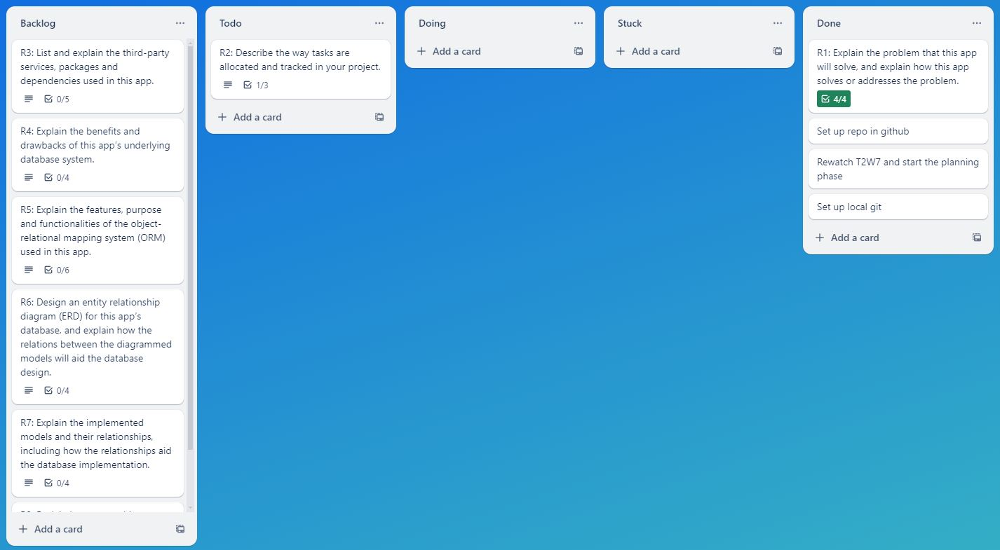
   
</p>
<p align="center"><i>Second Week</i></p>
<p align="center">
   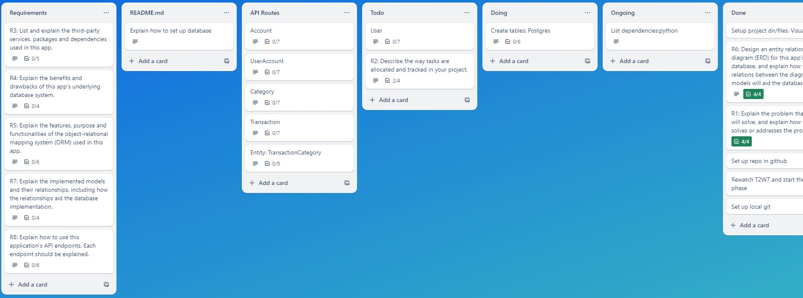
   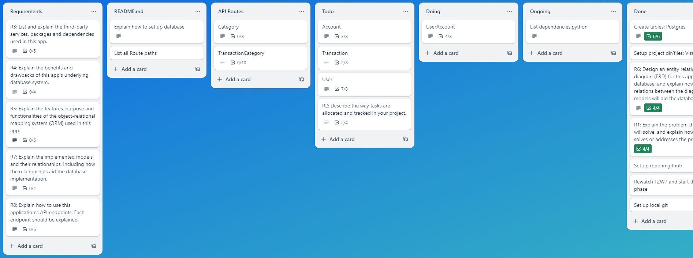
   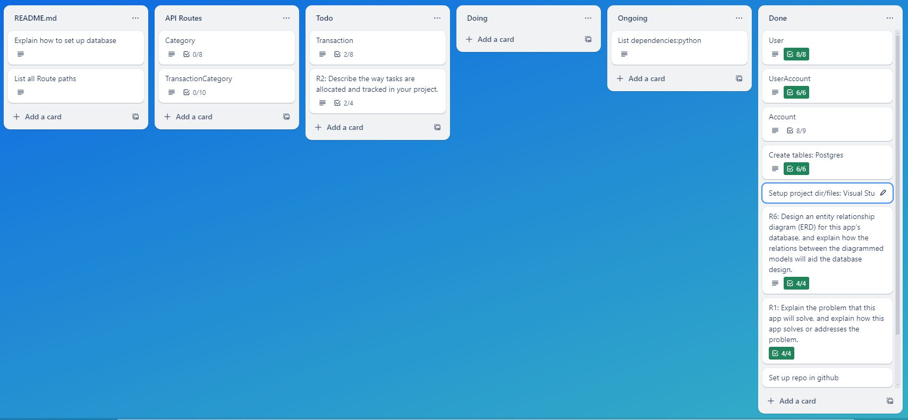
</p>
<p align="center"><i>Third Week</i></p>
<p align="center">
   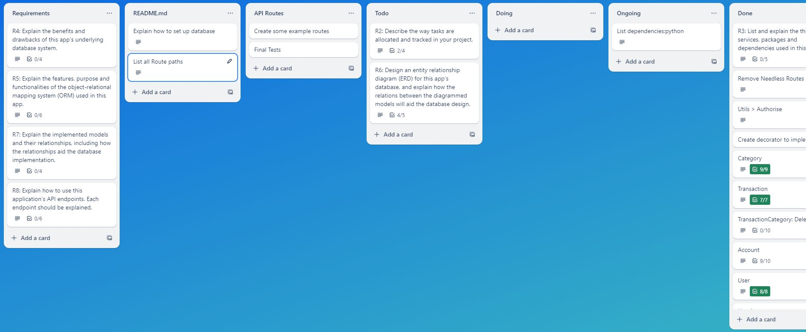
   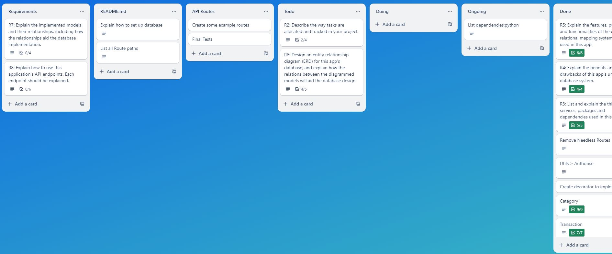
</p>
</details>

<details>
   <summary>Card Planning: Screenshots</summary>
<p align="center">
   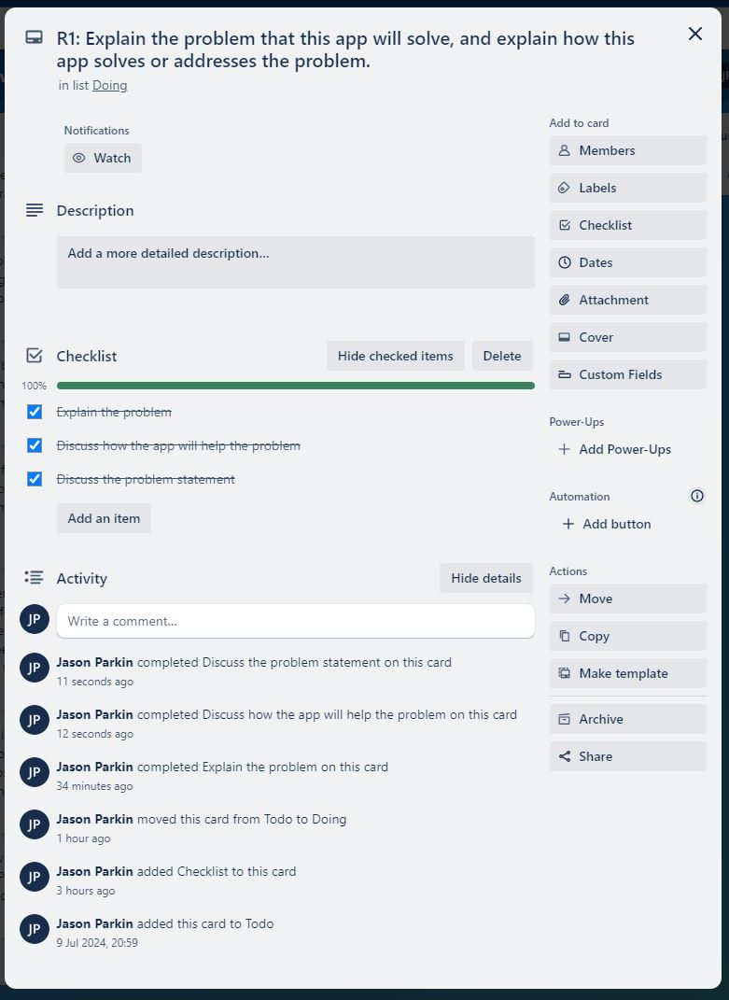
   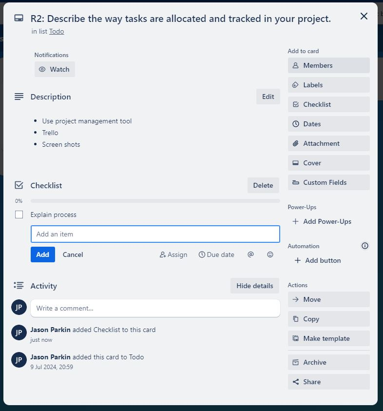
   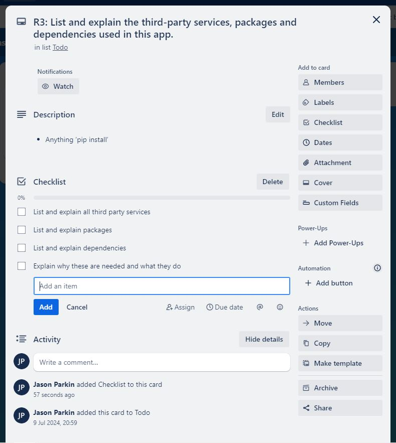
   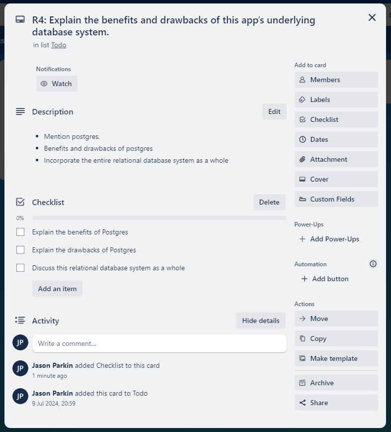
   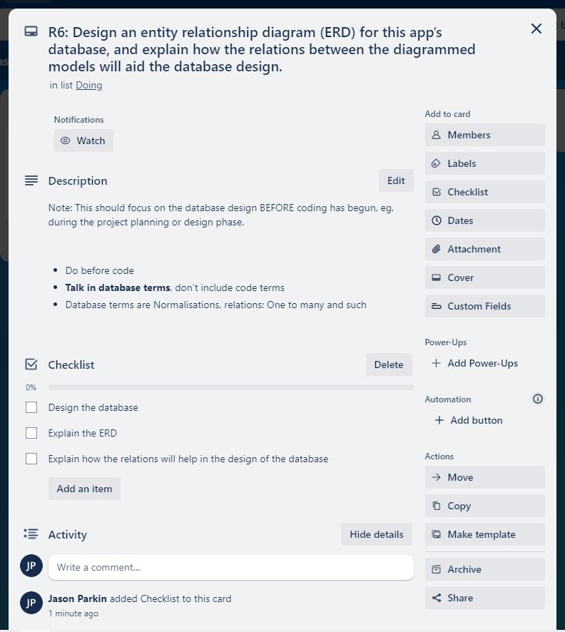
   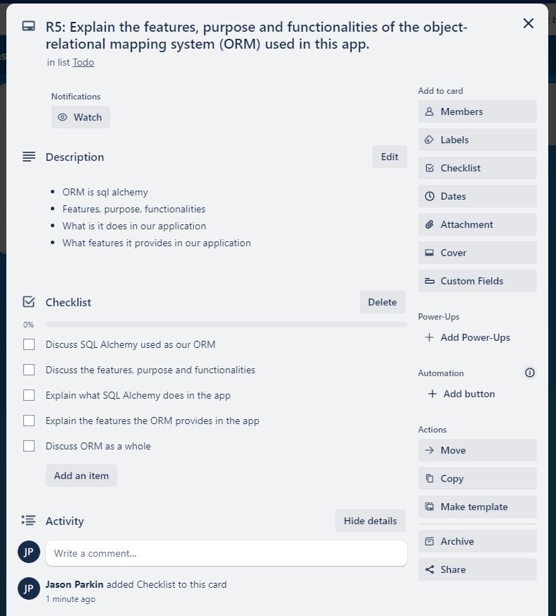
   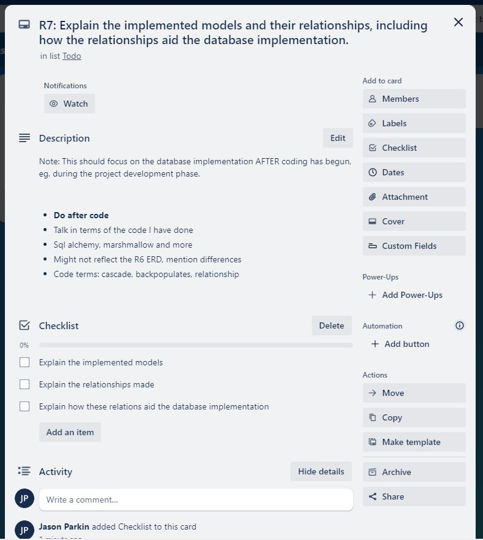
   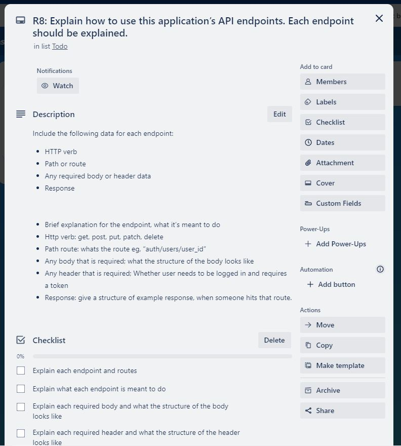
</p>
</details>

## R3: Third-party Services, Packages and Dependencies

> List and explain the third-party services, packages and dependencies used in this app.

<b>[SQLAlchemy](https://pypi.org/project/SQLAlchemy/)</b>

```bash
pip install SQLAlchemy
```

<b>Purpose:</b> SQLAlchemy is a SQL toolkit and Object-Relational Mapping (ORM) library for Python. It provides tools for database schema management and query construction, allowing developers to work with relational databases using Python objects rather than writing raw SQL queries.

<b>Usage:</b> It is used to manage database schemas, execute queries, and perform CRUD operations. SQLAlchemy supports multiple databases like PostgreSQL, MySQL, SQLite, etc.

<b>[Flask-SQLAlchemy](https://pypi.org/project/Flask-SQLAlchemy/)</b>

```bash
pip install Flask-SQLAlchemy
```

<b>Purpose:</b> Flask-SQLAlchemy is an extension for Flask that integrates SQLAlchemy with Flask applications. It provides a higher-level abstraction to manage database connections and ORM functionalities within a Flask app.

<b>Usage:</b> Simplifies database management in Flask by providing easy access to SQLAlchemy features and better integration with Flask's application context.

<b>[marshmallow-sqlalchemy](https://pypi.org/project/marshmallow-sqlalchemy/)</b>

```bash
pip install marshmallow-sqlalchemy
```

<b>Purpose:</b> This library extends Marshmallow, which is a library for object serialisation and deserialisation, to work specifically with SQLAlchemy ORM models. It facilitates the conversion of SQLAlchemy models to and from JSON.

<b>Usage:</b> Helps in serialising SQLAlchemy models into JSON format for API responses and deserialising JSON into SQLAlchemy models for processing incoming data.

<b>[flask-marshmallow](https://pypi.org/project/flask-marshmallow/)</b>

```bash
pip install flask-marshmallow
```

<b>Purpose:</b> Flask-Marshmallow integrates Marshmallow with Flask, providing a convenient way to serialise and deserialise data within Flask applications.

<b>Usage:</b> It combines Flask with Marshmallow's features for handling JSON serialisation and deserialisation, often used in Flask API endpoints.

<b>[Flask-Bcrypt](https://pypi.org/project/Flask-Bcrypt/)</b>

```bash
pip install Flask-Bcrypt
```

<b>Purpose:</b> Flask-Bcrypt is an extension that integrates bcrypt hashing with Flask applications. It provides a way to hash passwords securely using the bcrypt algorithm.

<b>Usage:</b> Typically used for password hashing and verification, enhancing security in authentication processes.

<b>[psycopg2](https://pypi.org/project/psycopg2/)</b>

```bash
pip install psycopg2
```

<b>Purpose:</b> Psycopg2 is a PostgreSQL adapter for Python, allowing Python applications to connect to and interact with PostgreSQL databases.

<b>Usage:</b> Provides the necessary interface for executing SQL commands and managing database connections with PostgreSQL.

<b>[psycopg2-binary](https://pypi.org/project/psycopg2-binary/)</b>

```bash
pip install psycopg2-binary
```

<b>Purpose:</b> Psycopg2-binary is a binary distribution of psycopg2 that includes precompiled binaries to simplify installation and avoid the need for compilation.

<b>Usage:</b> Provides the same functionality as psycopg2 but simplifies the installation process by including prebuilt binaries.

<br>

These can be found in the `requirements.txt` and can be installed with the following command:

```bash
pip install -r requirements.txt
```

<i>Note: In most modern setups where Python 2 is no longer in use, pip should work for Python 3.x as well. However, if you're unsure or have both Python 2 and 3 installed, using pip3 ensures that you're installing packages for Python 3.x.</i>

## R4: Benefits and Drawbacks of PostgreSQL

> Explain the benefits and drawbacks of this app’s underlying database system.

<b>Overview of Relational Database Systems (RDBMS)</b><br>
Relational Database Systems are databases that store data in a structured format, using rows and columns. They are based on the relational model introduced by E.F. Codd in the 1970s. Data is organised into tables, and relationships between data items are managed through foreign keys and indexes. SQL (Structured Query Language) is the standard language used to interact with RDBMS.

<b>Structured Data Storage</b>

- Data is organised into tables with predefined schemas.<br>
- Tables are made up of rows (records) and columns (fields), which helps in maintaining data consistency.

<b>Data Integrity</b>

- <b>ACID Transactions:</b> Ensures Atomicity, Consistency, Isolation, and Durability, which are crucial for reliable transaction processing.
- <b>Constraints:</b> Enforces data integrity through primary keys, foreign keys, unique constraints, and check constraints.

<b>Normalisation</b>

- <b>Normalisation:</b> The process of organising data to reduce redundancy and improve data integrity. This involves dividing tables into smaller, related tables.

<b>SQL Support</b>

- <b>Query Language:</b> Provides a powerful and standardised way to query and manipulate data using SQL.

<b>Indexing</b>

- <b>Indexes:</b> Improve the speed of data retrieval operations on tables.

<b>Relationships:</b>

- <b>Joins:</b> Facilitate complex queries by allowing the combination of data from multiple tables based on related columns.

### Benefits

1. <b>Advanced Features</b>

   - <b>ACID Compliance:</b> Ensures reliable transactions and data integrity.
   - <b>Complex Queries:</b> Supports complex queries with SQL, including sub-selects, joins, and window functions.
   - <b>Full-Text Search:</b> Provides built-in full-text search capabilities.
   - <b>JSON Support:</b> Allows storing and querying JSON data efficiently.

2. <b>Extensibility</b>

   - <b>Custom Data Types:</b> You can define your own data types and functions.
   - <b>Extensions:</b> Supports extensions like PostGIS for spatial data and others for added functionality.

3. <b>Scalability</b>

   - <b>Large Data Volumes:</b> Handles large databases efficiently.
   - <b>Concurrency Control:</b> Uses Multi-Version Concurrency Control (MVCC) to handle high concurrency with minimal locking.

4. <b>Standards Compliance</b>

   - <b>SQL Compliance:</b> Adheres closely to SQL standards, making it easier to migrate from other SQL databases.
   - <b>Data Integrity:</b> Enforces data integrity constraints such as foreign keys, unique constraints, and check constraints.

5. <b>Open Source</b>

   - <b>Cost-Effective:</b> No licensing costs associated with the software.
   - <b>Community Support:</b> Large community with extensive documentation, forums, and third-party tools.

6. <b>Performance Tuning</b>
   - <b>Indexing Options:</b> Offers various indexing strategies to optimise performance.
   - <b>Query Optimisation:</b> Advanced query planner and optimiser.

### Drawbacks

1. <b>Complexity</b>

   - <b>Configuration</b>: May require fine-tuning and complex configuration for optimal performance.
   - <b>Learning Curve</b>: Advanced features and extensibility can lead to a steeper learning curve.

2. <b>Performance Overheads</b>

   - <b>Write-Heavy Workloads</b>: While PostgreSQL handles read-heavy workloads well, write-heavy workloads might experience some performance overhead due to MVCC and other features.

3. <b>Resource Consumption</b>:

   - <b>Memory Usage</b>: Can be resource-intensive, especially with complex queries and large datasets.
   - <b>Disk Space</b>: May use more disk space due to its support for extensive features and indexing.

4. <b>Replication and Clustering</b>

   - <b>Built-in Options</b>: While PostgreSQL supports replication, clustering solutions are not as straightforward as those in some commercial databases.

5. <b>Tooling and Ecosystem</b>
   - <b>Third-Party Tools</b>: Some advanced features might not have as rich a set of third-party tools compared to commercial databases.

Relational database systems, like PostgreSQL, are great for handling structured data while ensuring data integrity, flexibility, and strong query capabilities. They work well for a lot of different applications, but as your data grows in size and complexity, you'll need to manage and optimise them carefully.

## R5: Object-Relational Mapping (ORM)

> Explain the features, purpose and functionalities of the object-relational mapping system (ORM) used in this app.

SQLAlchemy is a powerful ORM system, which was used in this application to interact with the database in an object-oriented way.

### Features of SQLAlchemy

1. <b>Declarative Mapping</b>

   - Allows defining classes mapped to database tables, using a declarative base. This makes the ORM models intuitive and easy to read.

2. <b>SQL Expression Language</b>

   - Provides a way to write SQL queries using Python constructs, offering both flexibility and the ability to perform complex queries.

3. <b>Session Management</b>

   - Manages transactions and connections to the database through a session system. This simplifies the process of committing changes, rolling back transactions, and querying the database.

4. <b>Relationships and Joins</b>

   - Simplifies the definition of relationships between tables. Supports one-to-many, many-to-one, and many-to-many relationships, allowing for complex data models.

5. <b>Schema Definition and Migration</b>

   - SQLAlchemy allows you to define your database schema using a declarative base class. This enables you to represent database tables as Python classes, making your code more readable and maintainable.

6. <b>Validation and Serialisation</b>

   - Integrates with Marshmallow for data validation and serialisation, making it easy to convert between database objects and Python dictionaries/JSON

### Purpose of SQLAlchemy

The primary purpose of SQLAlchemy is to bridge the gap between the object-oriented programming world of Python and the relational database management system (PostgreSQL in this case). It allows developers to interact with the database using Python objects and methods instead of writing raw SQL queries.

### Functionalities Provided by SQLAlchemy

1. <b>Database Model Definition</b>

   - I have defined models for `User`, `Account`, `UserAccount`, `Transaction`, and `Category` using SQLAlchemy. Each model class corresponds to a database table.

   <i>Model Definition: User</i>

   ```python
   class User(db.Model):
      # Define the table name
      __tablename__ = "users"

      # Define the primary key
      id = db.Column(db.Integer, primary_key=True)

      # More attributes (columns)
      name = db.Column(db.String(100))
      email = db.Column(db.String(100), nullable=False, unique=True)
      password_hash = db.Column(db.String(100), nullable=False)
      created_at = db.Column(db.Date)

      # Foreign relation
      user_account = db.relationship("UserAccount", back_populates = "user", cascade="all, delete-orphan")
      transaction = db.relationship("Transaction", back_populates = "user")
   ```

   <br>

2. <b>Relationships Management</b>

   - SQLAlchemy simplifies the management of relationships between tables. For instance, a `User` can have multiple `UserAccount` and `Transaction` records.

   <i>Foreign Relation: User</i>

   ```python
   # Foreign relation
   user_account = db.relationship("UserAccount", back_populates = "user", cascade="all, delete-orphan")
   transaction = db.relationship("Transaction", back_populates = "user")
   ```

   <br>

3. <b>Querying the Database</b>

   - Provides an easy way to query the database. For example, fetching all accounts for a user, joining tables, and applying filters is done seamlessly with SQLAlchemy.

   <i>DB Query: Account</i>

   ```python
   # Create a query to fetch accounts associated with the current user
   stmt = (
      db.select(Account)
      .join(UserAccount, Account.id == UserAccount.account_id)
      .filter(UserAccount.user_id == current_user_id)
      .order_by(Account.created_at.desc())
   )

   # Retrieve a list of scalar values from the result
   accounts = db.session.scalars(stmt)

   # Respond
   return accounts_schema.dump(accounts)
   ```

   <br>

4. <b>Session Management</b>

   - Handles sessions to manage transactions, ensuring that operations are atomic and the database state is consistent.

   <i>DB Query: Account</i>

   ```python
   # Add the new account and user_account to the session
   db.session.add(account)
   db.session.add(user_account)
   db.session.commit()

   # Respond
   return account_schema.dump(account), 201
   ```

   <br>

5. <b>Data Validation and Serialisation</b>

   - With Marshmallow schemas, SQLAlchemy models are validated and serialised efficiently. This is crucial for ensuring data integrity and converting data to/from JSON.

   <i>Data Validation: Account</i>

   ```python
    # Get the data from the body of the request
    body_data = account_schema.load(request.get_json())

    # Create a new instance of an account
    account = Account(
        name = body_data.get("name"),
        type = body_data.get("type"),
        created_at = date.today()
    )
   ```

   <br>

6. <b>CRUD Operations</b>

   - CRUD Operations refer to the basic operations for managing data in a database. They stand for `Create`, `Read`, `Update`, and `Delete`.

     1. <b>Create:</b> Adds new records to the database.
     2. <b>Read:</b> Read/Retrieves records from the database.
     3. <b>Update:</b> Modifies existing records in the database.
     4. <b>Delete:</b> Removes records from the database.

   In SQLAlchemy, these operations are typically facilitated using a session object.

   <i>CRUD: Example</i>

   ```python
   # Create a new account and add it to the database
   new_account = Account(name="John Doe", type="Checking", created_at=date.today())
   db.session.add(new_account)
   db.session.commit()

   # Read/Retrieve an account by its ID
   account_id = 1
   account = Account.query.get(account_id)

   # Update the name of an existing account
   if account:
      account.name = "Jane Doe"
      db.session.commit()

   # Delete an account from the database
   if account:
      db.session.delete(account)
      db.session.commit()
   ```

   <br>

SQLAlchemy in an application serves as a powerful and flexible ORM, allowing for the definition of database schemas as Python classes, management of relationships, execution of complex queries, and efficient handling of transactions. Its integration with Marshmallow further enhances data validation and serialisation, making it an indispensable tool for developing robust and maintainable applications.

## R6: Entity Relationship Diagram: Design Phase

> Design an entity relationship diagram (ERD) for this app’s database, and explain how the relations between the diagrammed models will aid the database design.

### User

<b>Attributes</b>

- `id` (Integer)
- `user_name` (String: max length 100)
- `user_email`(String: max length 100, unique, not nullable)
- `password_hash`(String: max length 100, not nullable)
- `created_at` (Date)

<b>Primary Key:</b> `id`<br>
<b>Relationships</b>

- Each User can have multiple UserAccount associations (one-to-many relationship).
- Each User can have multiple Transaction entries (one-to-many relationship).

### Account

<b>Attributes</b>

- `id` (Integer)
- `account_name` (String: max length 100, not nullable)
- `account_type` (String: max length 100, not nullable)
- `created_at` (Date)

<b>Primary Key:</b> `id`<br>
<b>Relationships</b>

- Each Account can have multiple UserAccount associations (one-to-many relationship).
- Each Account can have multiple Category entries (one-to-many relationship).
- Each Account can have multiple Transaction entries (one-to-many relationship).

### UserAccount

<b>Attributes</b>

- `id` (Integer)
- `role` (String: max length 100, not nullable)
- `is_admin` (Boolean, default False)
- `created_at` (Date)

<b>Primary Key:</b> `id` <br>
<b>Foreign Keys</b>

- `user_id` (Foreign Key referencing User.id, not nullable)
- `account_id` (Foreign Key referencing Account.id, not nullable)

<b>Relationships</b>

- Each UserAccount belongs to one User (many-to-one relationship).
- Each UserAccount belongs to one Account (many-to-one relationship).
- This table creates a many-to-many relationship between User and Account with additional attributes like role.

### Transaction

<b>Attributes</b>

- `id` (Primary Key, Integer)
- `type` (String: max length 100, not nullable)
- `amount` (Numeric: precision 10, scale 2, not nullable)
- `date` (Date)
- `description` (String: max length 100)
- `created_at` (Date)

<b>Primary Key:</b> `transaction_id`<br>
<b>Foreign Keys</b>

- `category_id` (Foreign Key referencing Category.id)
- `account_id` (Foreign Key referencing Account.id, not nullable)
- `user_id` (Foreign Key referencing User.id, not nullable)

<b>Relationships</b>

- Each Transaction belongs to one User (many-to-one relationship).
- Each Transaction belongs to one Account (many-to-one relationship).
- Each Transaction belongs to one Category (many-to-one relationship).

### Category

<b>Attributes</b>

- `id` (Integer)
- `name` (String: max length 100, not nullable)
- `created_at` (Date)

<b>Primary Key:</b> `id`<br>
<b>Foreign Keys</b>

- `account_id` (Foreign Key referencing Account.id, not nullable)

<b>Relationships</b>

- Each Category belongs to one Account (many-to-one relationship).
- Each Category can have multiple Transaction entries (one-to-many relationship).

### ERD Relations and Their Normalisation

<b>User Table</b>

- <b>Attributes:</b> `user_id`, `user_name`, `user_email`, `password_hash`, `created_at`
- <b>Normalisation:</b> This table is normalised up to <b>3NF</b>. All non-key attributes depend only on the primary key (id).

<b>Account Table</b>

- <b>Attributes:</b> `account_id`, `account_name`, `account_type`, `created_at`
- <b>Normalisation:</b> Similar to the User table, this is in <b>3NF</b>. All attributes are dependent on the primary key and there’s no transitive dependency.

<b>UserAccount Table</b>

- <b>Attributes:</b> `user_account_id`, `role`, `is_admin`, `created_at`, `user_id`, `account_id`
- <b>Normalisation:</b> This table normalises the many-to-many relationship between User and Account. It’s in <b>3NF</b> as attributes are fully dependent on id and not on the composite key of user_id and account_id.

<b>Transaction Table</b>

- <b>Attributes:</b> `transaction_id`, `transaction_type`, `amount`, `date`, `description`, `created_at`, `user_id`, `account_id`, `category_id`
- <b>Normalisation:</b> In <b>3NF</b>. The user_id, account_id, and category_id foreign keys are used to ensure all attributes are dependent on the primary key id.

<b>Category Table</b>

- <b>Attributes:</b> `category_id`, `category_name`, `created_at`, `account_id`
- <b>Normalisation:</b> In <b>3NF</b>. The account_id foreign key ensures that name and created_at are only dependent on id.

<details>
   <summary>Entity Relationship Diagram: Image</summary>
<p align="center"><i>Stage Design: Pitch</i>
   
</p>
<p align="center"><i>Stage Design: 01</i>
   
</p>
<p align="center"><i>Stage Design: 02</i>
   
</p>
<p align="center"><i>Stage Design: Final</i>
   
</p>
</details>

## R7: Entity Relationship Diagram: Development Phase

> Explain the implemented models and their relationships, including how the relationships aid the database implementation.

### User Model (user.py)

```python
class User(db.Model):
   # Define the table name
   __tablename__ = "users"

   # Define the primary key
   id = db.Column(db.Integer, primary_key=True)

   # More attributes (columns)
   name = db.Column(db.String(100))
   email = db.Column(db.String(100), nullable=False, unique=True)
   password_hash = db.Column(db.String(100), nullable=False)
   created_at = db.Column(db.Date)

   # Foreign relation
   user_account = db.relationship("UserAccount", back_populates = "user", cascade="all, delete-orphan")
   transaction = db.relationship("Transaction", back_populates = "user")
```

<b>Attributes</b>

- `id`: Primary key
- `name`: User's name
- `email`: Unique, required email address
- `password_hash`: Required hashed password
- `created_at`: Date the user was created

<b>Relationships</b>

- `user_account`: One-to-many relationship with UserAccount
- `transaction`: One-to-many relationship with Transaction

### UserAccount Model (user_account.py)

```python
class UserAccount(db.Model):
   # Define the table name
   __tablename__ = "user_accounts"

   # Define the primary key
   id = db.Column(db.Integer, primary_key=True)

   # More attributes(columns)
   role = db.Column(db.String(100), nullable=False)
   is_admin = db.Column(db.Boolean, default=False)

   # Foreign relation
   user_id= db.Column(db.Integer, db.ForeignKey("users.id"), nullable=False)
   account_id = db.Column(db.Integer, db.ForeignKey("accounts.id"), nullable=False)

   user = db.relationship("User", back_populates = "user_account")
   account = db.relationship("Account", back_populates = "user_account")
```

<b>Attributes</b>

- `id`: Primary key
- `role`: Role of the user in the account
- `is_admin`: Boolean flag for admin status
- `user_id`: Foreign key referencing User
- `account_id`: Foreign key referencing Account

<b>Relationships</b>

- `user`: Many-to-one relationship with User
- `account`: Many-to-one relationship with Account

### Account Model (account.py)

```python
class Account(db.Model):
   # Define the table name
   __tablename__ = "accounts"

   # Define the primary key
   id = db.Column(db.Integer, primary_key=True)

   # More attributes (columns)
   name = db.Column(db.String(100), nullable=False)
   type = db.Column(db.String(100), nullable=False)
   created_at = db.Column(db.Date)

   # Foreign relation
   user_account = db.relationship("UserAccount", cascade="all, delete-orphan", back_populates="account")
   category = db.relationship("Category", cascade="all, delete-orphan", back_populates="account")
   transaction = db.relationship("Transaction", cascade="all, delete-orphan", back_populates="account")
```

<b>Attributes</b>

- `id`: Primary key
- `name`: Account name
- `type`: Account type (Savings, Checking)
- `created_at`: Date the account was created

<b>Relationships</b>

- `user_account`: One-to-many relationship with UserAccount
- `category`: One-to-many relationship with Category
- `transaction`: One-to-many relationship with Transaction

### Transaction Model (transaction.py)

```python
class Transaction(db.Model):
   # Define the table name
   __tablename__ = "transactions"

   # Define the primary key
   id = db.Column(db.Integer, primary_key=True)

   # More attributes (columns)
   type = db.Column(db.String(100), nullable=False)
   amount = db.Column(db.Numeric(precision=10, scale=2), nullable=False)
   date = db.Column(db.Date)
   description = db.Column(db.String(100))
   created_at = db.Column(db.Date)

   # Foreign relation
   user_id = db.Column(db.Integer, db.ForeignKey("users.id"), nullable=False)
   account_id = db.Column(db.Integer, db.ForeignKey("accounts.id"), nullable=False)
   category_id = db.Column(db.Integer, db.ForeignKey("categories.id"))

   user = db.relationship("User", back_populates = "transaction")
   account = db.relationship("Account", back_populates = "transaction")
   category = db.relationship("Category", back_populates = "transaction")
```

<b>Attributes</b>

- `id`: Primary key
- `type`: Transaction type (Income, Expense)
- `amount`: Transaction amount
- `date`: Transaction date
- `description`: Description of the transaction
- `created_at`: Date the transaction was created
- `user_id`: Foreign key referencing User
- `account_id`: Foreign key referencing Account
- `category_id`: Foreign key referencing Category

<b>Relationships</b>

- `user`: Many-to-one relationship with User
- `account`: Many-to-one relationship with Account
- `category`: Many-to-one relationship with Category

### Category Model (category.py)

```python
class Category(db.Model):
   # Define the table name
   __tablename__ = "categories"

   # Define the primary key
   id = db.Column(db.Integer, primary_key=True)

   # More attributes(columns)
   name = db.Column(db.String(100), nullable=False)
   created_at = db.Column(db.Date)

   # Foreign relation
   account_id = db.Column(db.Integer, db.ForeignKey("accounts.id"), nullable=False)

   account = db.relationship("Account", back_populates = "category")
   transaction = db.relationship("Transaction", back_populates = "category")
```

<b>Attributes</b>

- `id`: Primary key
- `name`: Category name
- `created_at`: Date the category was created
- `account_id`: Foreign key referencing Account

<b>Relationships</b>

- `account`: Many-to-one relationship with Account
- `transaction`: One-to-many relationship with Transaction

### Key Terms and Concepts

- <b>db.relationship:</b> Used to define relationships between models. This creates foreign key relationships in the database.
- <b>back_populates:</b> It's a matching argument used with relationship that tells SQLAlchemy which attribute on the related class needs to be updated when the relationship changes.
- <b>cascade:</b> Specifies how operations should propagate to related objects. For example, all, delete-orphan means that all operations (like delete) should be applied to related objects, and orphaned objects should be deleted.

### Differences from R6 ERD

- <b>Attribute Names:</b> My final implementation uses name, email, password_hash while the ERD uses user_name, user_email.
- <b>Normalisation:</b> Both the ERD and my implementation maintain normalisation, ensuring no redundancy and proper relationship management.

## R8: API Endpoints Documentation

> Explain how to use this application’s API endpoints.

<h3>User Endpoints:</h3>

<h3>Register a New User</h3>

- HTTP Verb: `POST`
- Path or Route: `/users/register`

<b>Required Header</b>

- None

<b>Required Body Data</b>

- `name`: String - The name of the user.
- `email`: String - The user's email address (must be unique).
- `password_hash`: String - The user's password (will be hashed before storing).

```bash
{
    "name": "John Doe",
    "email": "john.doe@example.com",
    "password_hash": "Password123"
}
```

<b>Response</b>

- Success (201 Created)

```bash
{
    "id": 1,
    "name": "John Doe",
    "email": "john.doe@example.com",
    "created_at": "2024-07-25"
}
```

- Error (409 Conflict - Email already in use)

```bash
{
    "error": "Email address already in use"
}
```

- Error (409 Conflict - Required field missing)

```bash
{
    "error": "The column <column_name> is required"
}
```

<b>Explanation</b>

- This endpoint is used to create a new user in the system.
- The request body should include the name, email, and password_hash fields. The email must be unique, and the password_hash is hashed using bcrypt for security.

- <b>Process</b>

  1.  Extract data from the request body.
  2.  Create a new User object with the provided data.
  3.  Hash the password and assign it to the user object.
  4.  Add the user to the database and commit the transaction.

<h3>Login User</h3>

- HTTP Verb: `POST`
- Path or Route: `/users/login`

<b>Required Header</b>

- None

<b>Required Body Data</b>

- `email`: String - The user's email address.
- `password_hash`: String - The user's password.

```bash
{
    "email": "john.doe@example.com",
    "password_hash": "Password123"
}
```

<b>Response</b>

- Success (200 OK):

```bash
{
    "email": "john.doe@example.com",
    "token": "<jwt_token>"
}
```

- Error (401 Unauthorised - Invalid credentials):

```bash
{
    "error": "Invalid email or password"
}
```

<b>Explanation</b>

- This endpoint allows users to log in by providing their email and password_hash.

- <b>Process</b>

  1. Retrieve user details from the database based on the provided email.
  2. Check if the provided password matches the stored password hash.
  3. If the credentials are valid, generate a JWT token for the user.

<h3>Update User</h3>

- HTTP Verb: `PUT/PATCH`
- Path or Route: `/users/update`

<b>Required Header</b>

- Authorisation: `Bearer <jwt_token>`

<b>Required Body Data</b>

- `name`: String (optional) - The new name of the user.
- `password_hash`: String (optional) - The new password (will be hashed before storing).

```bash
{
    "name": "Jane Doe",
    "password_hash": "NewPassword123"
}
```

<b>Response</b>

- Success (200 OK):

```bash
{
    "id": 1,
    "name": "Jane Doe",
    "email": "john.doe@example.com",
    "created_at": "2024-07-25"
}
```

- Error (404 Not Found) - User does not exist:

```bash
{
    "error": "User does not exist"
}
```

<b>Explanation</b>

- This endpoint allows users to update their own information.

- <b>Process</b>

  1.  Extract user data from the request body (name, password_hash).
  2.  Fetch the current user from the database using the JWT token for authentication.
  3.  Update the user’s details with the provided data.
  4.  Commit the changes to the database.

<h3>Delete User</h3>

- HTTP Verb: `DELETE`
- Path or Route: `/users/delete`

<b>Required Header</b>

- Authorisation: `Bearer <jwt_token>`

<b>Required Body Data</b>

- None

<b>Response</b>

- Success (200 OK):

```bash
{
    "message": "User with id 1 deleted"
}
```

- Error (404 Not Found) - User does not exist:

```bash
{
    "error": "User does not exist"
}
```

<b>Explanation</b>

- This endpoint allows users to delete their own account.

- <b>Process</b>

  1.  Retrieve the user’s ID from the JWT token.
  2.  Fetch the user from the database.
  3.  If the user exists, delete the user record from the database.
  4.  Commit the changes.

---

<h3>Account Endpoints:</h3>

<h3>Create Account</h3>

- HTTP Verb: `POST`
- Path or Route: `/accounts/create`

<b>Required Header</b>

- Authorisation: `Bearer <jwt_token>`

<b>Request Body</b>

```bash
{
  "name": "New Account",
  "type": "Savings"
}
```

<b>Response</b>

- Success (201 Created)

```bash
{
  "id": 1,
  "name": "New Account",
  "type": "Savings",
  "created_at": "2024-07-25",
  "user_account": [...],
  "transaction": []
}
```

- Error (401 Unauthorised) - If the user is not authenticated:

```bash
{
  "error": "Authentication required"
}
```

- Error (404 Not Found) - User does not exist:

```bash
{
  "error": "User does not exist"
}
```

<b>Explanation</b>

- This endpoint allows the user to create a new account.

- <b>Process</b>
  1.  Retrieve the current user ID from the JWT token.
  2.  Extract data from the request body.
  3.  Create a new Account object and a UserAccount linking the user as an admin.
  4.  Add and commit the new account to the database.

<h3>Join Account</h3>

- HTTP Verb: `POST`
- Path or Route: `/accounts/join/<int:account_id>`

<b>Required Headers</b>

Authorisation: `Bearer <jwt_token>`

<b>Required Body Data</b>

- None

<b>Response</b>

- Success (201 Created):

```bash
{
  "id": 2,
  "name": "Joined Account",
  "type": "Savings",
  "created_at": "2024-07-25",
  "user_account": [...],
  "transaction": [...],
}
```

- Error (404 Not Found) - Account does not exist:

```bash
{
  "error": "Account with id <account_id> not found"
}

```

- Error (400 Bad Request):

```bash
{
  "error": "You are already a member of this account"
}
```

<b>Explanation</b>

- This endpoint allows the user to join an existing account as a viewer.

- <b>Process</b>
  1.  Retrieve the current user ID from the JWT token.
  2.  Check if the account exists and if the user is already a member.
  3.  Create a new UserAccount linking the user as a viewer.
  4.  Add and commit the new user account to the database.

<h3>Update Account</h3>

- HTTP Verb: `PUT/PATCH`
- Path or Route: `/accounts/update/<int:account_id>`

<b>Required Headers</b>

- Authorisation: Bearer <jwt_token>

<b>Required Body Data</b>

- name: String (optional) - The new name of the account.
- type: String (optional) - The new type of the account.

```bash
{
  "name": "Updated Account Name",
  "type": "Updated Type"
}
```

<b>Response</b>

- Success (200 OK):

```bash
{
  "id": 1,
  "name": "Updated Account Name",
  "type": "Updated Type",
  "created_at": "2024-07-25",
  "user_account": [...],
  "transaction": [...]
}
```

- Error (404 Not Found) - Account does not exist:

```bash
{
  "error": "Account does not exist"
}
```

<b>Explanation</b>

- This endpoint allows an admin to update the account’s name and type.

- <b>Process</b>

  1.  Authorise the user as an admin for the specified account.
  2.  Extract data from the request body.
  3.  Update the account’s details with the provided data.
  4.  Commit the changes to the database.

<h3>Delete Account</h3>

- HTTP Verb: `DELETE`
- Path or Route: `/accounts/delete/<int:account_id>`

<b>Required Headers</b>

- Authorisation: `Bearer <jwt_token>`

<b>Required Body Data</b>

- None

<b>Response</b>

- Success (200 OK):

```bash
{
  "message": "Account '1' deleted successfully"
}
```

- Error (404 Not Found) - Account does not exist:

```bash
{
  "error": "Account does not exist"
}
```

<b>Explanation</b>

- This endpoint allows an admin to delete an account.

- <b>Process</b>
  1.  Authorise the user as an admin for the specified account.
  2.  Fetch the account from the database.
  3.  Delete the account and commit the changes.

<h3>Get All Accounts</h3>

- HTTP Verb: `GET`
- Path or Route: `/accounts/all`

<b>Required Header</b>

- Authorisation: `Bearer <jwt_token>`

<b>Required Body Data</b>

- None

<b>Response</b>

- Success (200 OK) - Returns a list of accounts associated with the current user:

```bash
[
  {
    "id": 1,
    "name": "Account Name",
    "type": "Account Type",
    "created_at": "2024-07-25",
    "user_account": [...]
  },
  ...
]
```

- Error (401 Unauthorised) - If the user is not authenticated:

```bash
{
  "error": "Authentication required"
}
```

<b>Explanation</b>

- This endpoint fetches all accounts associated with the currently authenticated user.

- <b>Process</b>
  1.  Retrieve the user ID from the JWT token.
  2.  Query the Account table to find all accounts linked to this user via the UserAccount table.
  3.  Return the list of accounts.

<h3>Get All Categories</h3>

- HTTP Verb: `GET`
- Path or Route: `/accounts/<int:account_id>/categories`

<b>Required Headers</b>

- Authorisation: `Bearer <jwt_token>`

<b>Required Body Data</b>

- None

<b>Response</b>

- Success (200 OK):

```bash
[
  {
   "id": 1,
   "name": "Category Name",
   "created_at": "2024-07-23",
	"transaction": [...]
  },
  ...
]
```

- Error (404 Not Found) - No Account:

```bash
{
  "error": "Account not found"
}
```

- Error (404 Not Found) - No categories:

```bash
{
  "error": "This account has no categories"
}
```

<b>Explanation</b>

- This endpoint fetches all categories associated with a specific account.

- <b>Process</b>

  1.  Authorise the user for the specified account.
  2.  Query the Category table to find all categories linked to the account.
  3.  Return the list of categories.

<h3>Get All Transactions</h3>

- HTTP Verb: `GET`
- Path or Route: `/accounts/<int:account_id>/transactions`

<b>Required Headers</b>

- Authorisation: `Bearer <jwt_token>`

<b>Required Body Data</b>

- None

<b>Response</b>

- Success (200 OK)

```bash
[
  {
    "id": 1,
    "type": "Transaction Type",
    "amount": 100.00,
    "date": "2024-07-25",
    "description": "Transaction Description",
    "created_at": "2024-07-25",
    "user_id": {...},
    "account": {...},
    "category": {...}
  },
  ...
]
```

- Error (404 Not Found) - No Account:

```bash
{
  "error": "Account not found"
}
```

- Error (404 Not Found) - No transactions:

```bash
{
  "error": "This account has no transactions"
}
```

<b>Explanation</b>

- This endpoint fetches all transactions associated with a specific account.

- <b>Process</b>

  1.  Authorise the user for the specified account.
  2.  Query the Transaction table to find all transactions linked to the account.
  3.  Return the list of transactions.

---

<h3>User Account Endpoints</h3>

<h3>Delete(Leave) User Account</h3>

- HTTP Verb: `DELETE`
- Path or Route: `/user_accounts/<int:user_account_id>`

<b>Required Headers</b>

- Authorisation: `Bearer <jwt_token>`

<b>Required Body Data</b>

- None

<b>Response</b>

- Success (200 OK):

```bash
{
  "message": "User Account '1' deleted successfully"
}
```

Error (404 Not Found):

```bash
{
  "error": "User Account with id <user_account_id> not found"
}
```

- Error (401 Unauthorised):

```bash
{
  "error": "You are not authorised to remove this user account"
}
```

<b>Explanation</b>

- This endpoint allows a user to leave a user account or for an admin to remove a user account.

- <b>Process</b>

  1.  Fetch the UserAccount instance from the database using user_account_id.
  2.  Verify the user account exists.
  3.  Retrieve the current user ID from the JWT token and fetch the current user from the database.
  4.  Check if the current user is an admin:
      - Admins can delete user accounts from the same account.
      - Regular users can only delete their own account.
  5.  If authorised, delete the user account and commit the changes.

<h3>Update User Role</h3>

- HTTP Verb: `PUT/PATCH`
- Path or Route: `/user_accounts/update/<int:user_account_id>`

Required Headers

- Authorisation: `Bearer <jwt_token>`

<b>Required Body Data</b>

- `role`: String (optional) - The new role for the user account.

```bash
{
  "role": "New Role"
}
```

<b>Response</b>

- Success (200 OK)

```bash
{
  "id": 1,
  "role": "New Role",
  "is_admin": true
  "user": {...}
  "account": {...}
}
```

- Error (404 Not Found) - User Account does not exist:

```bash
{
  "error": "User Account does not exist"
}
```

<b>Explanation</b>

- This endpoint allows an admin to update the role of a user account.

- Process
  1.  Authorise the user as an admin for the specified account.
  2.  Extract the new role from the request body.
  3.  Fetch the UserAccount instance from the database using user_account_id.
  4.  Verify the user account exists.
  5.  Update the user account’s role and admin status based on the new role.
  6.  Commit the changes to the database.

---

<h3>Transaction Endpoints</h3>

<h3>Create Transaction</h3>

- HTTP Verb: `POST`
- Path or Route: `/transactions/create/<int:account_id>`

<b>Required Headers</b>

- Authorisation: `Bearer <jwt_token>`

<b>Required Body Data</b>

- `type`: String - The type of the transaction ("expense" or "income").
- `amount`: Float - The amount of the transaction.
- `date`: String - The date of the transaction in YYYY-MM-DD format.
- `description`: String - A description of the transaction.
- `category_name`: String - The name of the category for the transaction (optional).

```bash
{
  "type": "Expense",
  "amount": 100.00,
  "date": "2024-07-25",
  "description": "Groceries",
  "category_name": "Food"
}
```

<b>Response</b>

- Success (201 Created):

```bash
{
  "id": 1,
  "type": "Expense",
  "amount": 100.0,
  "date": "2024-07-25",
  "description": "Groceries",
  "created_at": "2024-07-25",
  "user": {...},
  "account": {...},
  "category": "Food",
  "category_id": 2
}
```

- Error (404 Not Found) - Account does not exist:

```bash
{
  "error": "Account does not exist"
}
```

- Error (409 Conflict) - Category already exist:

```bash
{
  "error": "Category with the same name already exists in this account"
}
```

- Error (400 Bad Request):

```bash
{
  "error": "Invalid date format. Date should be in YYYY-MM-DD format"
}
```

<b>Explanation</b>

- This endpoint allows only admins or contributors to create a new transaction for a specific account.

- <b>Process</b>
  1.  Fetch the account from the database using account_id.
  2.  Verify the account exists.
  3.  Extract and validate the category_name from the request body.
      - If provided, check if the category exists for the account, and create a new one if it doesn't.
  4.  Get the current user ID from the JWT token.
  5.  Extract and validate the transaction details from the request body.
  6.  Create a new Transaction instance and associate it with the account and user.
  7.  Add and commit the new transaction to the database.

<h3>Delete Transactions</h3>

- HTTP Verb: `DELETE`
- Path or Route: `/transactions/delete/<int:transaction_id>`

<b>Required Headers</b>

- Authorisation: `Bearer <jwt_token>`

<b>Required Body Data</b>

- None

<b>Response</b>

- Success (200 OK):

```bash
{
  "message": "Transaction '1' deleted successfully"
}
```

- Error (404 Not Found) - Transaction does not exist:

```bash
{
  "error": "Transactions 1 not found"
}
```

<b>Explanation</b>

- This endpoint allows only admins to delete a specific transaction.

- <b>Process</b>

  1.  Fetch the transaction from the database using transaction_id.
  2.  Verify the transaction exists.
  3.  Delete the transaction and commit the changes.

<h3>Update Transaction</h3>

- HTTP Verb: `PUT/PATCH`
- Path or Route: `/transactions/update/<int:transaction_id>`

Required Headers

- Authorisation: `Bearer <jwt_token>`

Required Body Data:

- `type`: String - The type of the transaction (optional).
- `amount`: Float - The amount of the transaction (optional).
- `date`: String - The date of the transaction in YYYY-MM-DD format (optional).
- `description`: String - A description of the transaction (optional).
- `category_id`: Integer - The ID of the category for the transaction (optional).

```bash
{
  "type": "Income",
  "amount": 200.00,
  "date": "2024-07-26",
  "description": "Salary",
  "category_id": 2
}
```

<b>Response</b>

- Success (200 OK):

```bash
{
  "id": 1,
  "type": "Income",
  "amount": 200.0,
  "date": "2024-07-26",
  "description": "Salary",
  "created_at": "2024-07-25",
  "user": {...},
  "account": {...},
  "category_name": "Food",
  "category_id": 2,

}
```

- Error (400 Bad Request):

```bash
{
  "error": "Invalid date format. Date should be in YYYY-MM-DD format"
}
```

- Error (404 Not Found) - Category does not exist:

```bash
{
  "error": "Category 2 not found in this account"
}
```

<b>Explanation</b>

- This endpoint allows admins or contributors to update the details of a specific transaction.

- <b>Process</b>
  1.  Fetch the transaction from the database using transaction_id.
  2.  Verify the transaction exists.
  3.  Extract and validate the transaction details from the request body.
  4.  If a new category is specified, ensure it exists and belongs to the same account as the transaction.
  5.  Update the transaction details and commit the changes.

---

<h3>Category Endpoints:</h3>

<h3>Create Category</h3>

- HTTP Verb: `POST`
- Path or Route: `/categories/create/<int:account_id>`

<b>Required Headers</b>

- Authorisation: `Bearer <jwt_token>`

<b>Required Body Data</b>

- `category_name`: String - The name of the category

```bash
{
  "category_name": "Entertainment"
}
```

<b>Response</b>

- Success (201 Created):

```bash
{
  "id": 1,
  "name": "Entertainment",
  "created_at": "2024-07-25",
  "transaction": []
}
```

- Error (400 Bad Request):

```bash
{
  "error": "Category name is needed"
}
```

- Error (404 Not Found) - Account does not exist:

```bash
{
  "error": "Account does not exist"
}
```

- Error (409 Conflict) - Category already exist:

```bash
{
  "error": "Category with the same name already exists in this account"
}
```

<b>Explanation</b>

- This endpoint allows only admins or contributors to create a new category for a specific account.

- <b>Process</b>

  1.  Fetch the account from the database using account_id.
  2.  Verify the account exists.
  3.  Extract and validate the category_name from the request body.
  4.  Check if a category with the same name already exists in the account.
  5.  Create a new Category instance if it doesn't exist.
  6.  Add and commit the new category to the database.

<h3>Update Category</h3>

- HTTP Verb: `PUT/PATCH`
- Path or Route: `/categories/update/<int:category_id>`

<b>Required Headers</b>

- Authorisation: `Bearer <jwt_token>`

<b>Required Body Data</b>

- `name`: String - The new name of the category (optional).

```bash
{
  "name": "Leisure"
}
```

<b>Response</b>

- Success (200 OK):

```bash
{
  "id": 1,
  "name": "Leisure",
  "created_at": "2024-07-25",
  "transaction": [...]
}
```

- Error (404 Not Found) - Category does not exist:

```bash
{
  "error": "Category 1 not found"
}
```

<b>Explanation</b>

- This endpoint allows admins or contributors to update the details of a specific category.

- <b>Process</b>

  1.  Fetch the category from the database using category_id.
  2.  Verify the category exists.
  3.  Extract and validate the category details from the request body.
  4.  Update the category details and commit the changes.

<h3>Delete Category</h3>

- HTTP Verb: `DELETE`
- Path or Route: `/categories/delete/<int:category_id>`

<b>Required Headers</b>

- Authorisation: `Bearer <jwt_token>`

<b>Required Body Data</b>

- None

```bash
{
  "message": "Category '1' deleted successfully"
}
```

- Error (404 Not Found) - Category does not exist:

```bash
{
  "error": "Category 1 not found"
}
```

<b>Explanation</b>

- This endpoint allows only admins to delete a specific category.

- <b>Process</b>

  1.  Fetch the category from the database using category_id.
  2.  Verify the category exists.
  3.  Delete the category and commit the changes.

<h3>Get Category by ID</h3>

- HTTP Verb: `GET`
- Path or Route: `/categories/<int:category_id>`

<b>Required Headers</b>

- Authorisation: `Bearer <jwt_token>`

<b>Required Body Data</b>

- None

<b>Response</b>

- Success (200 OK)

```bash
{
  "id": 1,
  "name": "Groceries",
  "created_at": "2024-07-25",
  "transaction": [...]
}
```

- Error (404 Not Found) - Category does not exist:

```bash
{
  "error": "Category 1 not found"
}
```

<b>Explanation</b>

- This endpoint allows users with Admin, Contributor, or Viewer roles to fetch a category by its ID.

- <b>Process</b>

1. Fetch the category from the database using category_id.
2. Verify the category exists.
