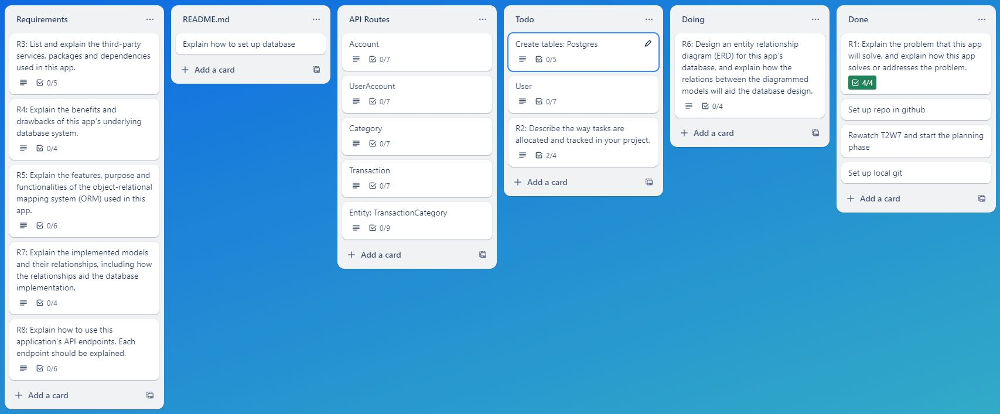

# API Webserver: Income & Expense Tracker

## R1: Problem Statement

Managing personal and shared finances can be challenging, especially for couples who need to keep track of joint income and expenses.  
Many existing financial management tools offer comprehensive budget planning features, but they often fall short in providing a simple and efficient way to track financial transactions among multiple users.  
This can lead to difficulties in maintaining shared finances, resulting in misunderstandings or conflicts over financial matters.

Personally, I've tried budgeting apps, but nothing suited what I needed, leaving my wife and me to compare expenses at the end of the week. This left holes in our budget.  
I've spent many hours on the internet in search of an expense tracker that can be shared between couples so that no expense is left untracked.   
I haven't yet found one that works for me... next best solution? create my own.

### Solution

The Income and Expense Tracker API is here to make managing money easier for couples.  
It simplifies how you track your finances, allowing you to effortlessly record income and expenses.  
It provides a user-friendly solution for tracking financial transactions, focusing on recording income and expenses while supporting the sharing of transaction accounts between partners.  

Here’s how the app will address the problem:

#### Simplified Financial Tracking

The API makes it easy to record income and expenses, capturing key details like transaction type, amount, date, and description. This straightforward approach helps couples keep accurate financial records without the hassle of a complex budget planner.

#### Shared Accounts

A standout feature is the ability to share transaction accounts with multiple users, perfect for couples managing joint finances. Both partners can view and record transactions, encouraging transparency and collaboration.

#### User Roles and Permissions

The API allows for assigning different roles within shared accounts, such as owner, user, or authorised user. This role-based access control ensures each partner has the right level of access and permissions, ensuring security.

#### Categorisation & Organisation

Users can categorise transactions to better organise their financial data. This helps couples understand their spending patterns and income sources, making financial planning and decision-making easier.

#### Real-time Collaboration

With multiple users able to interact with the same account in real-time, the API ensures all financial data is up-to-date and accessible to both partners. This eliminates delays and ensures everyone is on the same page about their financial status.

The Income and Expense Tracker API addresses the common challenges couples face in managing their joint finances. By focusing on simplicity, shared account functionality, user roles, categorisation, and real-time collaboration, the API provides a solution for financial organisation, and cooperation. This approach makes it easier for couples to manage their income and expenses, reducing the financial misunderstandings.

## R2: Task Allocation and Tracking

To ensure thorough task management and progress tracking, I use Trello.  
Trello allows me to organise tasks visually and track their status through various stages of completion.

1. <b>Task Allocation</b>

   - <b>Task Creation:</b> I create tasks as individual Trello cards, each representing a specific task that needs completion.
   - <b>Details and Deadlines:</b> Each card includes a detailed description, relevant attachments and checklists. This keeps me organised and ensures I have all necessary information to complete the task.

2. <b>Tracking Progress</b>

   - <b>Backlog:</b> This list contains all tasks that need to be done eventually but are not yet prioritised. It's future tasks that I can move to "To Do" when ready to start working on them.

   - <b>To Do:</b> This list includes all tasks that need starting. New tasks are added here, giving a clear view of what's next.

   - <b>Doing:</b> Once I start working on a task, I move its card from "To Do" to "Doing." This helps me focus on current tasks and manage my workflow efficiently.

   - <b>Done:</b> Completed tasks go into the "Done" list, providing a sense of accomplishment and a clear record of finished work.

   - <b>Stuck:</b> If a task encounters an issue or can't proceed, it goes to the "Stuck" list. This helps me quickly spot and resolve bottlenecks.

3. <b>Communication and Updates</b>

   - <b>Notes:</b> I add notes to each card for updates, recording important information, or documenting task-related issues.

   - <b>Notifications:</b> Trello notifies me about approaching deadlines and any updates or changes to cards, helping me stay informed and manage time effectively.

4. <b>Review</b>

   - <b>Regular Review:</b> I regularly review task statuses and project progress to stay on track and adjust my workflow as needed.

   - <b>Board Review:</b> Periodically, I review the Trello board to ensure tasks move smoothly. This early identification of delays or issues allows prompt resolution.

 

Live link: [API Webserver: Income & Expense Tracker](https://trello.com/b/Xe5Zb2LJ)

   
Trello Planning: Screenshots

    
    

## R6: ERD Design

### User

<b>Attributes:</b> `user_id`, `user_name`, `user_email`, `password_hash`, `created_at`  
<b>Primary Key:</b> `user_id`

#### Relationships  

- Each user can have multiple UserAccount associations (one-to-many relationship).
- Each user can have multiple Category entries (one-to-many relationship).
- Each user can have multiple Transaction entries (one-to-many relationship).

### Account  

<b>Attributes:</b> `account_id`, `account_name`, `account_type`, `created_at`  
<b>Primary Key:</b> `account_id`

#### Relationships  

- Each account can have multiple UserAccount associations (one-to-many relationship).
- Each account can have multiple Transaction entries (one-to-many relationship).

### UserAccount  

<b>Attributes:</b> `user_account_id`, `role`, `user_id`, `account_id`, `created_at`  
<b>Primary Key:</b> `user_account_id`

#### Relationships  

- user_id is a foreign key referring to User.
- account_id is a foreign key referring to Account.
- This table creates a many-to-many relationship between User and Account with additional attributes like role.

### Transaction  

<b>Attributes:</b> `transaction_id`, `transaction_type`, `amount`, `date`, `description`, `created_at`, `account_id`, `user_id`  
<b>Primary Key:</b> `transaction_id`

#### Relationships

- Each transaction belongs to one user.
  - user_id is a foreign key referring to User.
- Each transaction belongs to one account.
  - account_id is a foreign key referring to Account.
- Each transaction belong to one category.
  - category_id is a foreign key referring to Category.

### Category  

<b>Attributes:</b> `category_id`, `category_name`, `created_at`, `user_id`  
<b>Primary Key:</b> `category_id`

#### Relationships

- Each category belongs to one user.
  - user_id is a foreign key referring to User.

   
Entity Relationship Diagram: Image

Stage Design: Pitch
   

Stage Design: 01
   

Stage Design: Final
   

